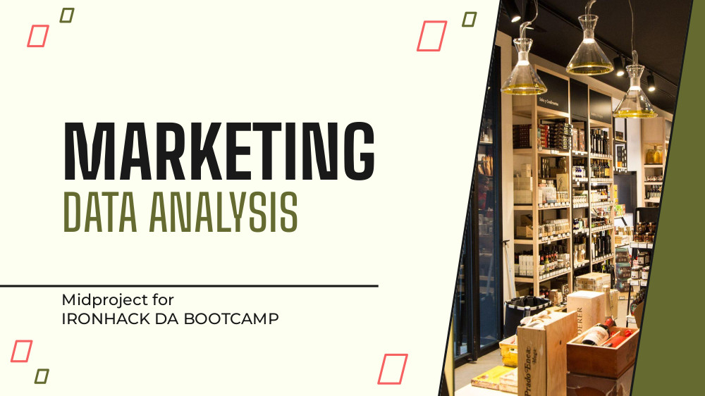

  <h1>Midproject: MARKETING DATA ANALYSIS</h1>

   

---

  <h2>About the Project :house_with_garden:	</h2>

  

    The purpose of this project is to <strong>analyze and interpret a dataset</strong> with information about the <strong>customers of a store</strong>. We don't know what type of business it is except that they <strong>sell grocery items</strong>. We only know what <strong>types of products they provide</strong>, the ways in which <strong>customers have previously purchased</strong> and some <strong>metrics about marketing campaigns</strong> launched.
  

  
  <h3>Objective:</h3>
  

    It is up to us to determine what type of <strong>clientele</strong> we have, what their relationship is with the products on sale and to interpret how the <strong>campaigns</strong> launched have gone.
We will also try, with the final reading of all the data, to give some guidelines to the <strong>marketing department</strong> to increase <strong>sales</strong>.
  

  
<h3>Methodology:</h3>
  <ol>
    <li><u><strong>Data Cleaning:</strong></u> We commence by meticulously cleaning the dataset, addressing missing values, outliers, and inconsistencies to ensure the integrity and reliability of our subsequent analyses.</li>
    <li><u><strong>Data Wrangling:</strong></u> After data cleaning, we've undertaken data wrangling tasks to adapt the dataset for improved categorical interpretation of customer behavior and gain better insights into continuous variables related to their activities.</li>
    <li><u><strong>Exploratory Data Analysis (EDA):</strong></u> During EDA, we have not only identified various customer profiles but also detected purchasing patterns within these profiles, unraveling insights, patterns, and correlations crucial for feature selection and model development.</li>
    <li><u><strong>Buyer Persona:</strong></u> By employing customer segmentation techniques and analyzing learned patterns, we craft comprehensive profiles of our most frequent customers.</li>
  </ol>

---

<h2>Project Structure :open_file_folder:</h2>

  This project is developed through three notebooks.

<ol>
  <li>
    <strong><a href="https://github.com/TonioDominguez/Midproject_Marketing_Data_Analysis/blob/main/code/initial%20set%20up.ipynb">INITAL SET UP:</a></strong> In this first Nb we performed the tasks of data extraction, standardization of variables for the subsequent step, to perform the EDA.
  </li>
  
  <li>
    <strong><a href="https://github.com/TonioDominguez/Midproject_Marketing_Data_Analysis/blob/main/code/EDA.ipynb">EDA:</a></strong> This Nb is intended for the interpretation of data from the previously cleaned dataset. We break down the statistics of the customers, their consumption patterns and ways of purchasing and their activities in campaigns.
  </li>
  
  <li>
    <strong><a href="https://github.com/TonioDominguez/Midproject_Marketing_Data_Analysis/blob/main/code/Buyer%20Persona.ipynb">BUYER PERSONA DESIGN:</a></strong> In this final step, we use the segmentation defined during the EDA to create detailed profiles of our most frequent customers and clearly visualize their consumption habits and purchasing trends.
  </li>
</ol>

  As a final presentation of what has been developed and obtained in this project, we also include some explanatory slides. You can download the slides from <strong><a href="https://github.com/TonioDominguez/Midproject_Marketing_Data_Analysis/blob/main/slides/MARKETING%20Data%20Analysis.pdf">here</a></strong>.

---

  <h2>Documentation: OG Variables :bookmark_tabs:	</h2>

  

    Below is a summary of the variables provided in the original dataframe, offering valuable context for the project:
  

  <ul>
    <li><strong>id:</strong> A unique identifier for a house.</li>
    <li><strong>date:</strong> The date on which the house was sold.</li>
    <li><strong>price:</strong> The sale price of the house (prediction target).</li>
    <li><strong>bedrooms:</strong> Number of bedrooms in the house.</li>
    <li><strong>bathrooms:</strong> Number of bathrooms in the house, per bedroom.</li>
    <li><strong>sqft_living:</strong> Square footage of the interior living space.</li>
    <li><strong>sqft_lot:</strong> Square footage of the land space.</li>
    <li><strong>floors:</strong> Number of floors (levels) in the house.</li>
    <li><strong>waterfront:</strong> Whether the house has a waterfront view.</li>
    <li><strong>view:</strong> Number of times the house has been viewed.</li>
    <li><strong>condition:</strong> The overall condition of the house.</li>
    <li><strong>grade:</strong> The overall grade given to the house, based on the King County grading system.</li>
    <li><strong>sqft_above:</strong> Square footage of the house apart from the basement.</li>
    <li><strong>sqft_basement:</strong> Square footage of the basement.</li>
    <li><strong>yr_built:</strong> The year the house was built.</li>
    <li><strong>yr_renovated:</strong> The year the house was renovated.</li>
    <li><strong>zipcode:</strong> ZIP code area.</li>
    <li><strong>lat:</strong> Latitude coordinate.</li>
    <li><strong>long:</strong> Longitude coordinate.</li>
    <li><strong>sqft_living15:</strong> The interior living space for the nearest 15 neighbors in 2015.</li>
    <li><strong>sqft_lot15:</strong> The land spaces for the nearest 15 neighbors in 2015.</li>
  </ul>

  

    <strong>TARGET:</strong> Price: Our primary focus is to understand which features most significantly impact the house price.
  

---

  <h2>Conclusion :eye:</h2>

  

    As a fellow beginner in the realm of machine learning, I sincerely hope you've found this project both enjoyable and enlightening. Embarking on this journey has been a thrilling adventure filled with challenges and discoveries, and I'm excited to share it with you.
  

  

    While the path ahead may seem daunting at times, never forget the joy of discovery and the thrill of solving complex problems with machine learning. Embrace the journey, embrace the challenges, and most importantly, embrace the excitement of learning something new.
  

